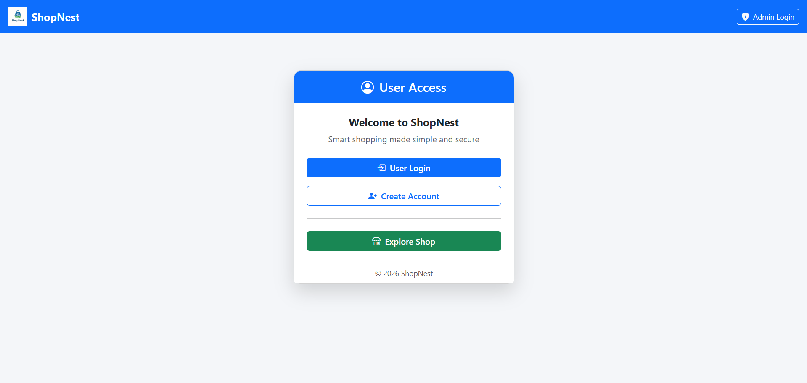
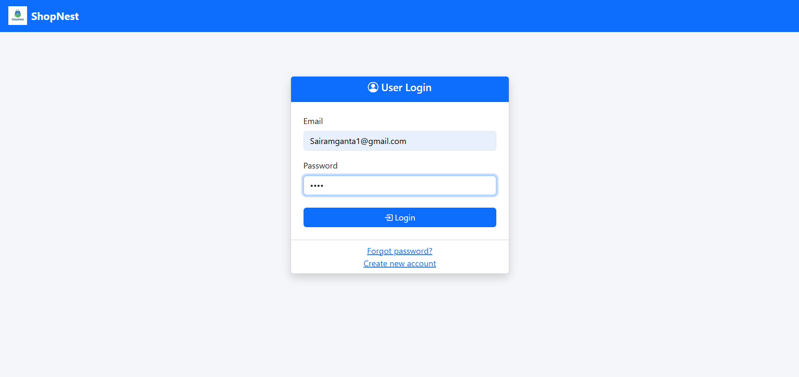
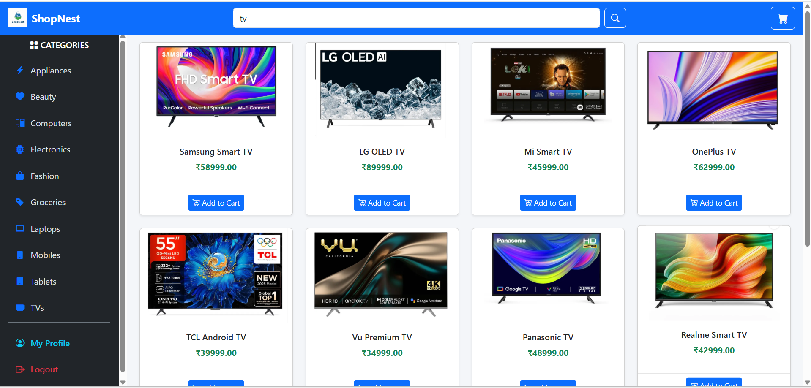
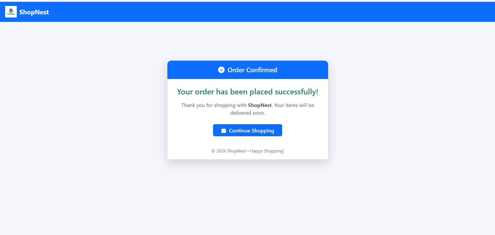
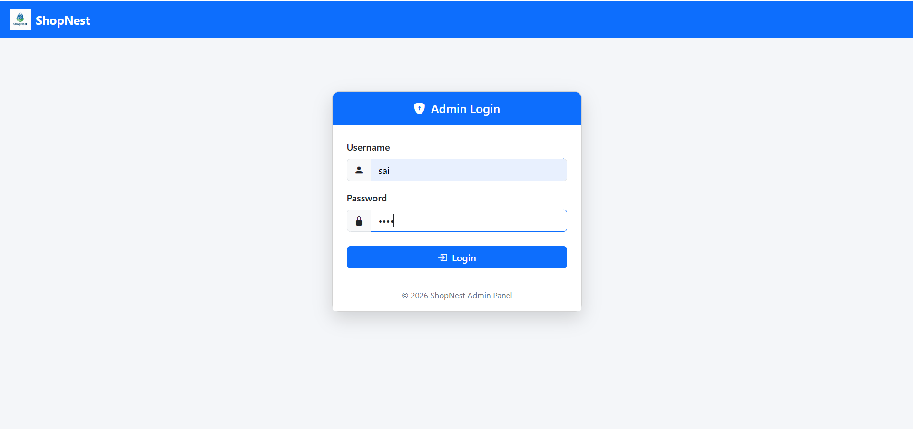
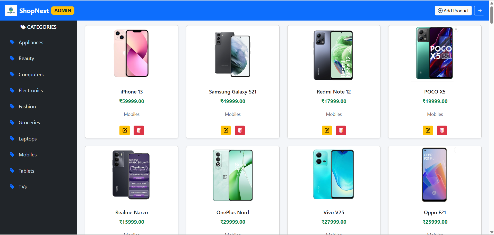

# 🛒 ShopNest - E-Commerce Application

## 📌 Overview

ShopNest is a full-stack e-commerce web application built using Spring Boot, Thymeleaf, and MySQL.  
It implements a complete online shopping workflow including authentication, product browsing, cart management, and order placement.

The application follows a clean MVC layered architecture and demonstrates real-world backend development practices.

---

## 🛠 Tech Stack

- Java
- Spring Boot
- Spring MVC
- Spring Data JPA (Hibernate)
- MySQL
- Thymeleaf
- HTML, CSS, JavaScript
- Maven

---

## 👥 Modules

### 🧑 User Module (Fully Implemented)

- User Registration & Login
- View Products by Category
- Search Products
- Add to Cart
- Remove from Cart
- Session-Based Cart Management
- Place Order
- Order Confirmation
- View Profile
- User Dashboard

---

### 👨‍💼 Admin Module (Partially Implemented)

- Admin Login
- Admin Dashboard
- Add Products
- Edit Products
- Delete Products
- Manage Categories

(Admin enhancements in progress)

---

## 🏗 Architecture

The project follows a layered MVC architecture:

Controller → Service → Repository → Database

This ensures:

- Clear separation of concerns
- Scalable and modular structure
- Maintainable business logic
- Clean data access layer

---

## 🗄 Database Design

- Designed normalized relational schema
- Implemented proper entity relationships (OneToMany, ManyToOne)
- Applied indexing on frequently queried fields
- Optimized JPA queries to reduce redundant database calls

---

## ⚡ Performance Optimization

- Reduced unnecessary DB fetch operations
- Structured service-layer logic to avoid duplication
- Optimized repository queries
- Managed cart using HTTP session to reduce database overhead

---

## 🔐 Security Implementation

- Role-based login system (User / Admin)
- Server-side validation for form inputs
- Secure database interaction using JPA (prevents SQL injection)
- Session management for authentication control

---

## Application Screenshots

### 🏠 Home Page

### 🔐 User Login

### 👤 User Dashboard

### 👤 User Profile

### 🛍 Products Using Categories

### 🔍 Products Using Search

### 🛒 Cart

### 💳 Place Order

### ✅ Order Success

### 🔐 Admin Login

### 📊 Admin Dashboard

---

## 🚀 How to Run Locally

1. Clone the repository:

   git clone https://github.com/sairam468/shopnest-ecommerce-application.git

2. Configure MySQL in `application.properties`

3. Create database:

   CREATE DATABASE shopnest;

4. Run:

   ShopNestApplication.java

5. Open browser:

   http://localhost:8080

---

## 🚀 Future Enhancements

- Payment Gateway Integration
- JWT-based Authentication
- Order Tracking System
- Admin Analytics Dashboard
- Pagination & Sorting
- Role-based Spring Security integration

---

## 🎯 Key Learning Outcomes

- Built a complete e-commerce workflow using Spring Boot
- Applied MVC design pattern in a real-world application
- Designed optimized relational database schema
- Implemented role-based access structure
- Integrated Thymeleaf templates with backend controllers
- Improved performance through JPA query optimization

---

## 👨‍💻 Author

**Ganta Lakshman Naga Durga Sairam**  
Java Full Stack Developer  
Hyderabad, India
