# 🛒 ShopNest - E-Commerce Application

## 📌 Overview

ShopNest is a full-stack e-commerce web application built using **Spring Boot, Thymeleaf, and MySQL**.  
It implements a complete online shopping workflow including authentication, product browsing, cart management, and order placement.

The application follows a **clean MVC layered architecture** and demonstrates real-world backend development practices.

---

## 🛠 Tech Stack

- Java
- Spring Boot
- Spring MVC
- Spring Data JPA (Hibernate)
- MySQL
- Thymeleaf
- HTML, CSS, JavaScript
- Maven

---

## 👥 Modules

### 🧑 User Module (Fully Implemented)

- User Registration & Login
- View Products by Category
- Search Products
- Add to Cart
- Remove from Cart
- Session-Based Cart Management
- Place Order
- Order Confirmation
- View Profile
- User Dashboard

---

### 👨‍💼 Admin Module

The Admin panel allows management of the product catalog.

#### Implemented Features

- Admin Login  
- Admin Dashboard  
- Add New Products  
- Edit / Update Products  
- Deactivate Products (Soft Delete)  
- Manage Product Categories  

#### Product Lifecycle Management

Products are **not permanently deleted** if they are referenced in orders.

Instead, a **soft-delete strategy** is implemented using an `active` flag.

- Active products → visible to customers  
- Inactive products → hidden from storefront  
- Order history remains intact  

This approach preserves **referential integrity and historical order data**.

---

## 🏗 Architecture

The project follows a layered **MVC architecture**:

Controller → Service → Repository → Database

Benefits:

- Clear separation of concerns
- Scalable and modular structure
- Maintainable business logic
- Clean data access layer

---

## 🗄 Database Design

- Designed normalized relational schema
- Implemented entity relationships (OneToMany, ManyToOne)
- Applied indexing on frequently queried fields
- Optimized JPA queries to reduce redundant database calls
- Implemented **soft delete for products** to prevent foreign key violations with `order_items`

---

## ⚡ Performance Optimization

- Reduced unnecessary DB fetch operations
- Structured service-layer logic to avoid duplication
- Optimized repository queries
- Managed cart using **HTTP session** to reduce database overhead

---

## 🔐 Security Implementation

- Role-based login system (User / Admin)
- Server-side validation for form inputs
- Secure database interaction using JPA (prevents SQL injection)
- Session management for authentication control

---

# 📸 Application Screenshots

## 🏠 Home Page
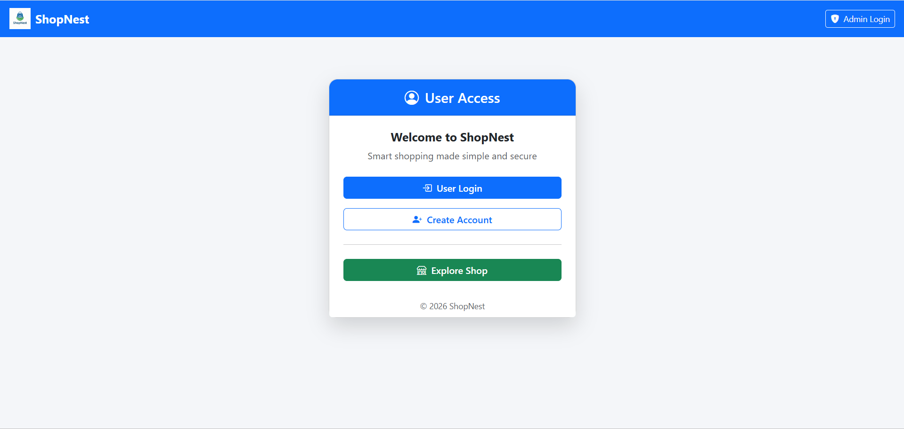

## 🔐 User Login
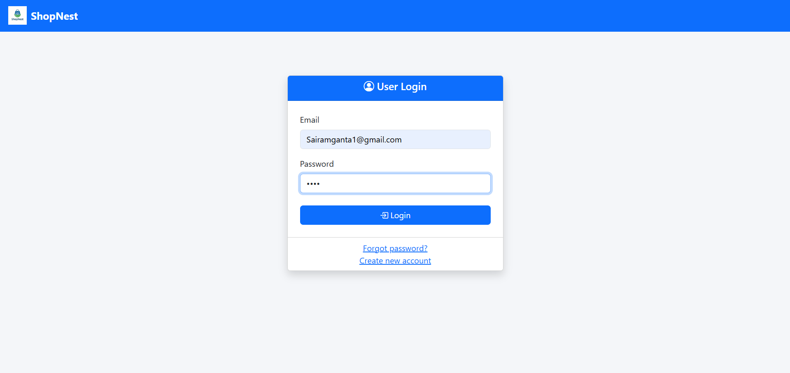

## 👤 User Dashboard
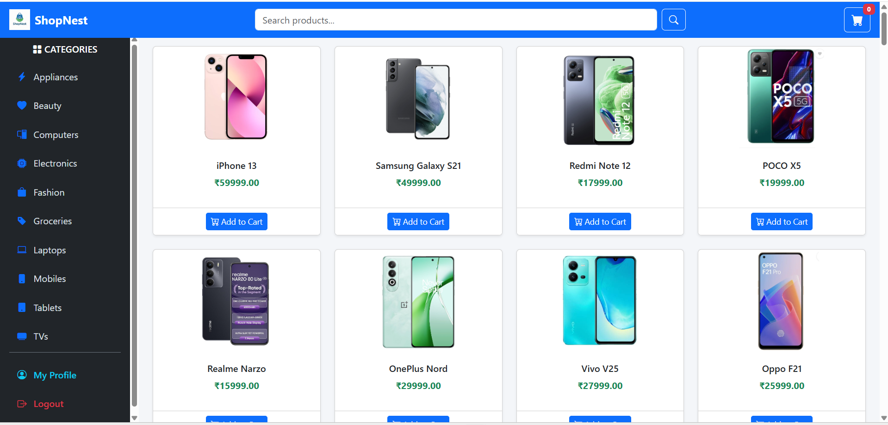

## 👤 User Profile
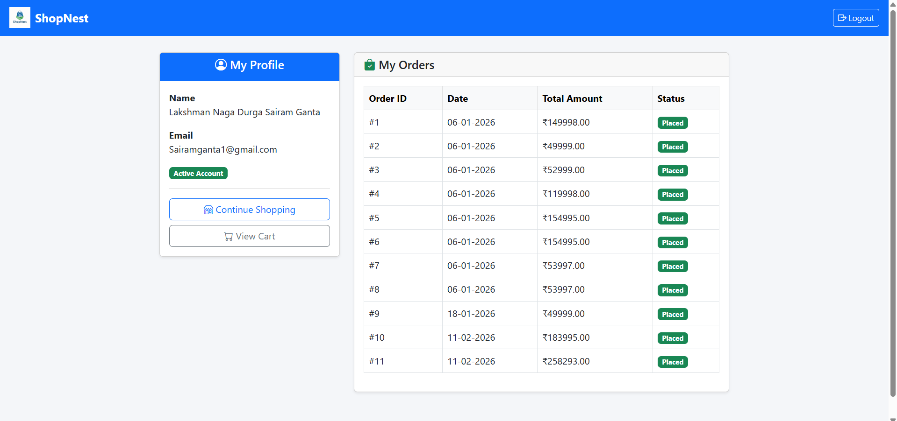

## 🛍 Products Using Categories
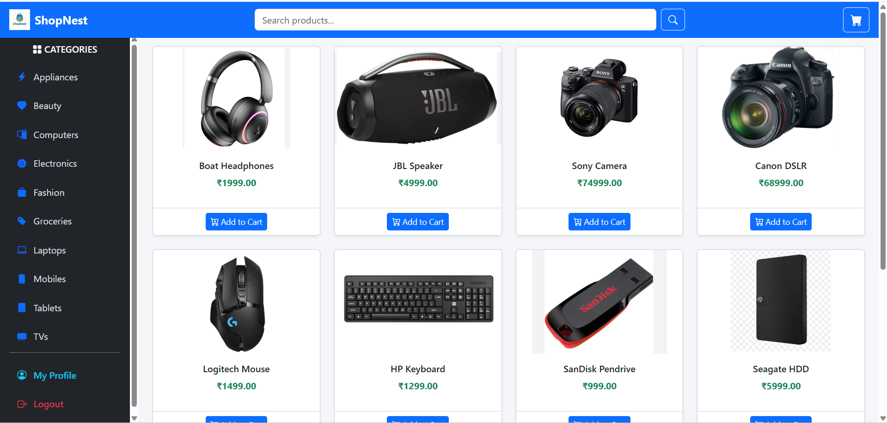

## 🔍 Products Using Search
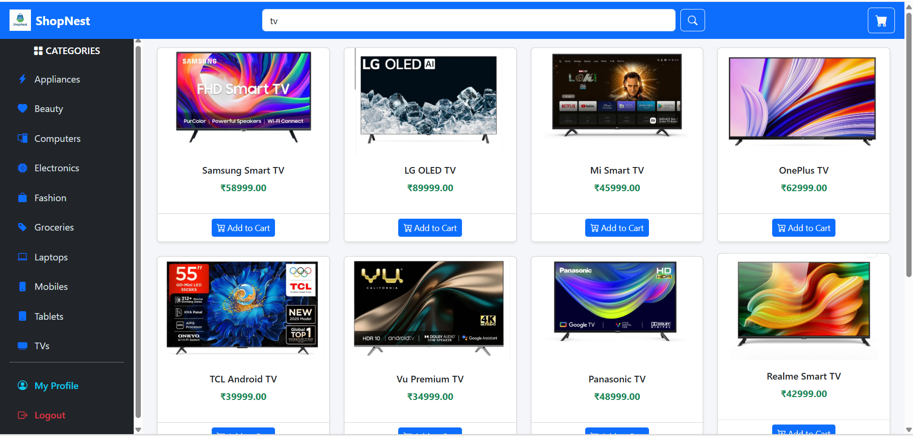

## 🛒 Cart
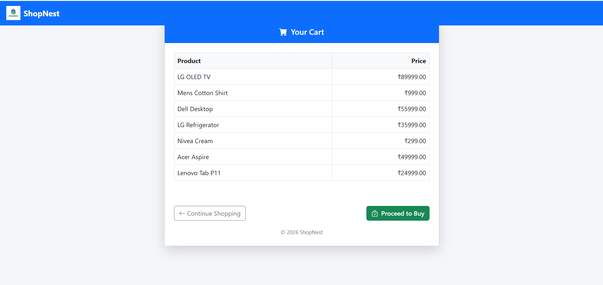

## 💳 Place Order
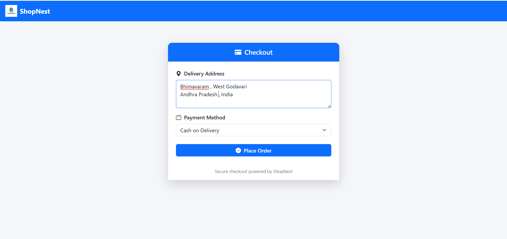

## ✅ Order Success
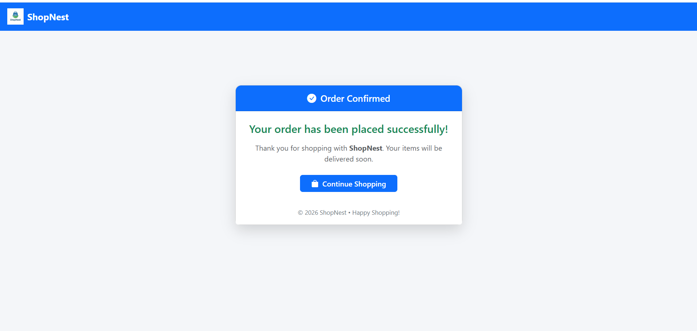

---

# 👨‍💼 Admin Panel

## 🔐 Admin Login
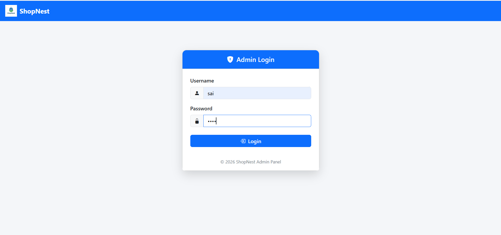

## 📊 Admin Dashboard
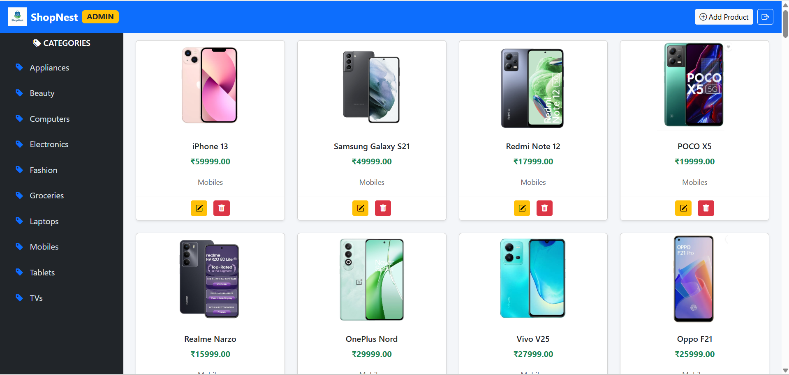

---

## ➕ Add Product
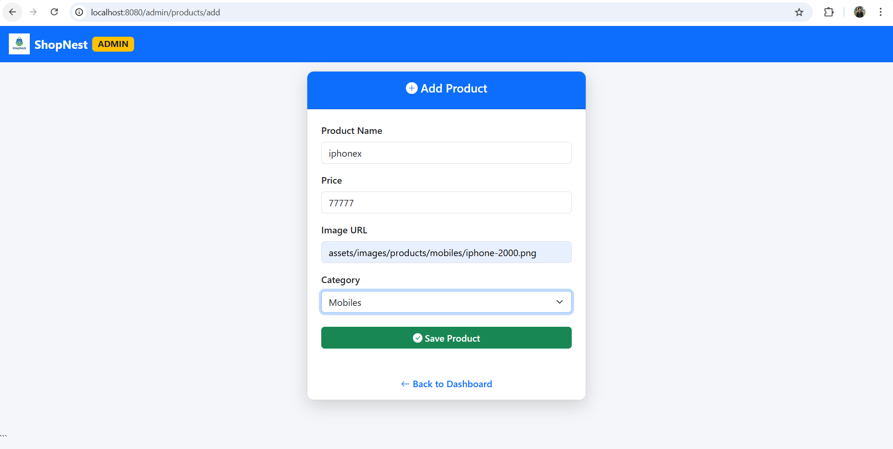

## ✅ Product Added
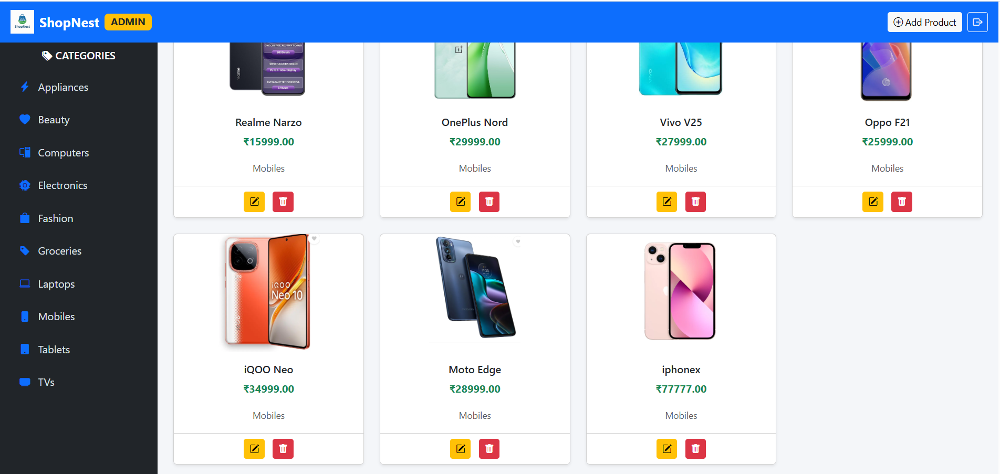

## ✏ Update Product
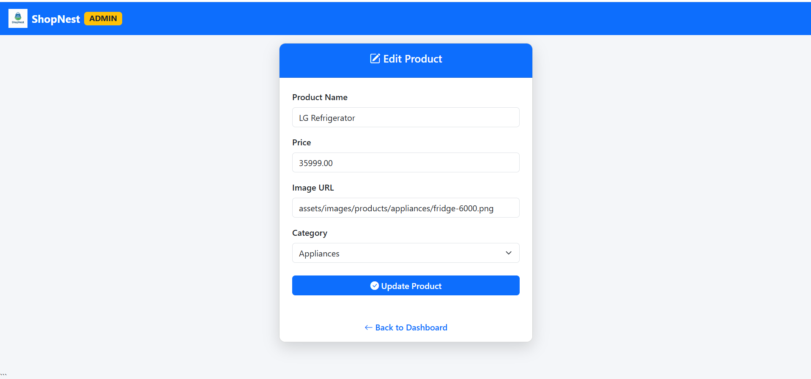

## ✅ Product Updated
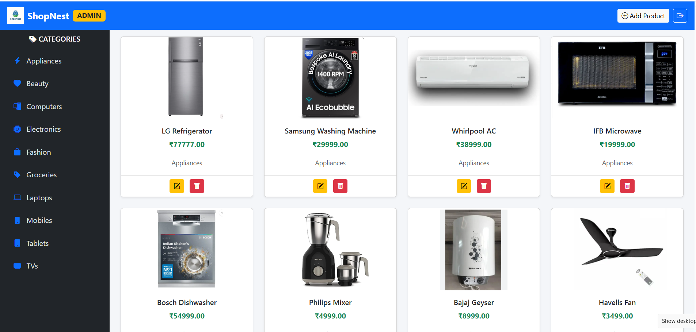

## ⚠ Delete Confirmation
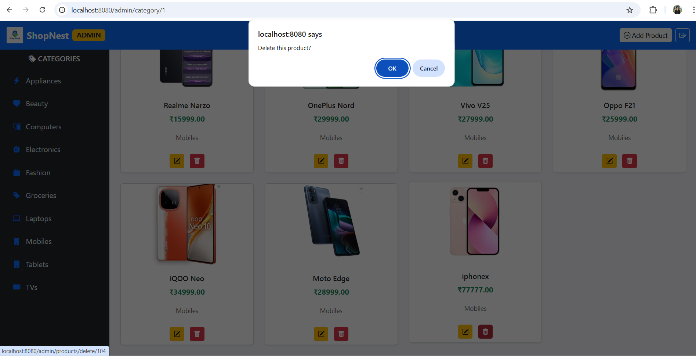

## ❌ Product Deactivated
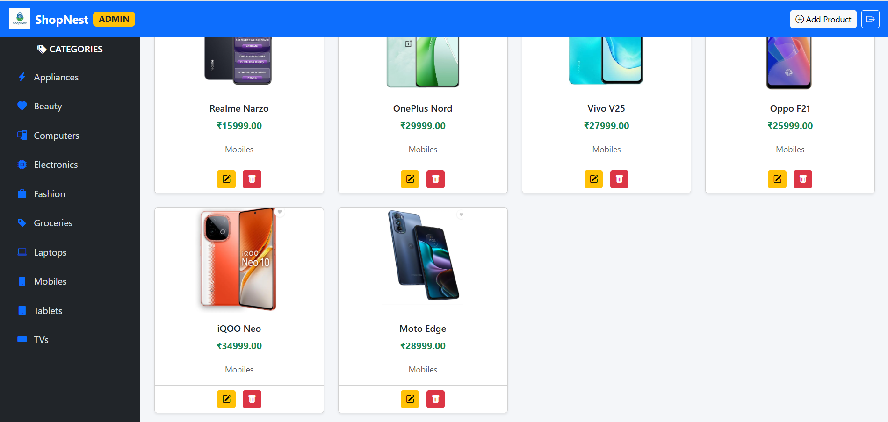

---

# 🚀 How to Run Locally

### 1️⃣ Clone the repository

```
git clone https://github.com/sairam468/shopnest-ecommerce-application.git
```

### 2️⃣ Configure MySQL

Update database configuration in:

```
application.properties
```

### 3️⃣ Create Database

```
CREATE DATABASE shopnest;
```

### 4️⃣ Run the Application

Run:

```
ShopNestApplication.java
```

### 5️⃣ Open in Browser

```
http://localhost:8080
```

---

# 🚀 Future Enhancements

- Payment Gateway Integration
- JWT-based Authentication
- Order Tracking System
- Admin Analytics Dashboard
- Pagination & Sorting
- Role-based Spring Security integration

---

# 🎯 Key Learning Outcomes

- Built a complete e-commerce workflow using Spring Boot
- Applied MVC design pattern in a real-world application
- Designed optimized relational database schema
- Implemented role-based access structure
- Integrated Thymeleaf templates with backend controllers
- Implemented **soft-delete strategy for product lifecycle management**
- Improved performance through JPA query optimization

---

# 👨‍💻 Author

**Ganta Lakshman Naga Durga Sairam**  
Java Full Stack Developer
